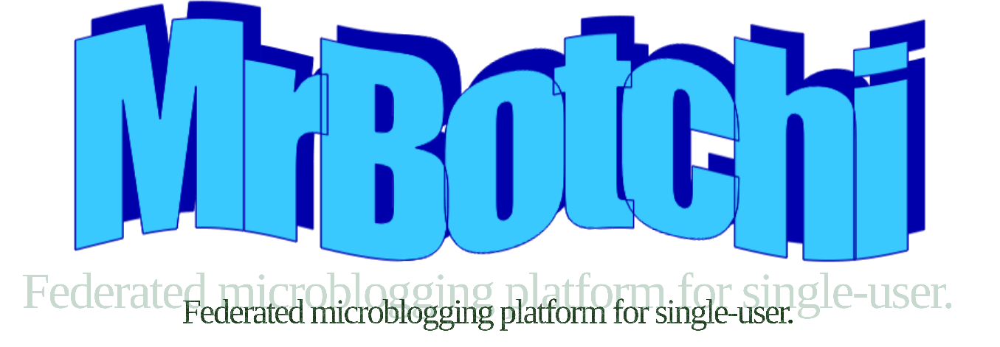

= MrBotchi

IMPORTANT: 香川県ではこのソフトウェアの使用は違法になる可能性があります。我々は香川県民がこのソフトウェアを使用することを想定しておりません。使用する場合は、自己責任でお願いします。

*_Let's get everything in hand!_*

MrBotchi is federated microblogging platform *for single-user.* Since it exists within the Fediverse, It can communicate with other social networking platforms such as Mastodon, Misskey and Pleroma.

== What is the "Botchi"?

It's a word that means "people without friends" in Japanese.

== Feature
* [ ] ActivityPub compatible
* [ ] Mastodon compatible WebAPI
* [ ] Misskey compatible emoji reaction
* [ ] Plugin system
* [ ] Multi-user (NOT Multi-account)

== VS.
|===
| ^|Mastodon ^|Misskey ^|MrBotchi

>s|Quote post ^.^|No ^.^|Yes ^.^|Yes
>s|Emoji reaction ^.^|No ^.^|Yes ^.^|Yes
>s|Reversi ^.^|No ^.^|Yes ^.^|No
>s|Very cute Showgirl ^.^|No ^.^|Yes ^.^|No
>s|Very, very cute Schwimmwagen ^.^|No ^.^|No ^.^s|YEEEEEES
|===

TIP: These items are still in the planning stages and are not necessarily implemented.

== License

Licensed under the GNU Affero General Public License Version 3(link:./LICENSE[LICENSE] or https://opensource.org/licenses/AGPL-3.0)

== Author

https://www.sc3.fun[銀猫さん] (link:mailto:silverscat_3@mail.sc3.fun[silverscat_3@mail.sc3.fun])
